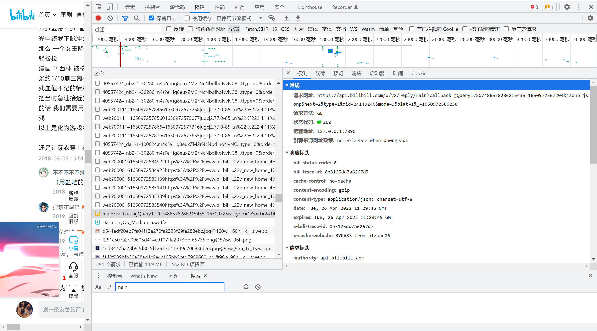

视频评论从这个接口爬：

`https://api.bilibili.com/x/v2/reply/main`

```
params = {
    "oid": "",  # 视频aid
    "next": "1",  # 评论分页 从1开始
    "mode": "3",  # 3:按热度排序 2：按时间排序
    "type": "1",  # 就这一个type能用好像
}
```


视频列表从这个接口爬：

`https://api.bilibili.com/x/space/arc/search`

```
params = {
    "mid": "27534330",  # up主id
    "ps": "50",  # 条数 max=50
    "pn": "1",  # 页数
    "order": "pubdate",  # 按时间排序 click：按播放量排序
}
```

视频信息从`get https://www.bilibili.com/video/<bid>/`的html里爬：

```
"videoData": {
    "bvid": "BV1aW411P7UJ",
    "aid": 24149246,
    "videos": 1,
    "tid": 47,
    "tname": "短片·手书·配音",
    "copyright": 1,
    "pic": "http:\u002F\u002Fi0.hdslb.com\u002Fbfs\u002Farchive\u002Fed881fa267c6e3248573550d551892c99368d120.jpg",
    "title": "《崩坏3》动画短片「女王降临」",
    "pubdate": 1527739201,
    "ctime": 1527736376,
    "desc": "简介: 《崩坏3》动画短片「女王降临」正式发布！\n掌控空间、统御崩坏兽的女王终于降临了，在她经过的地方，只留下破坏和死亡……\n\n本片由miHoYo Anime出品，片中印象曲《Befall》由HOYO-MiX制作，电子唱作人尚雯婕演唱。\n视频类型: 原创动画\n相关题材: 崩坏3",
    ...
}
```

